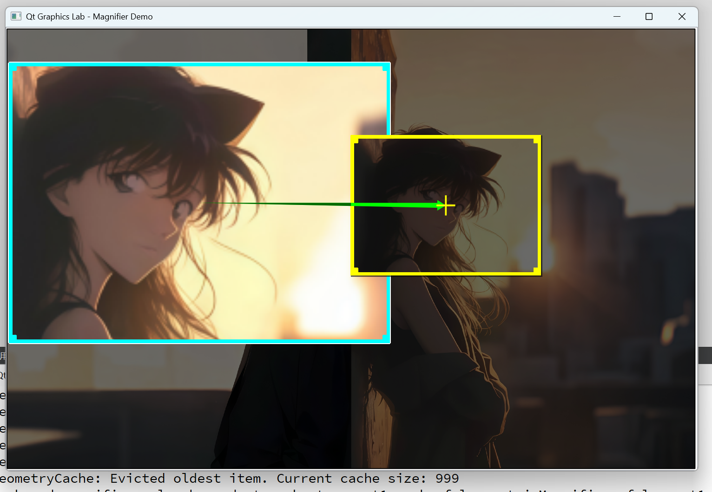
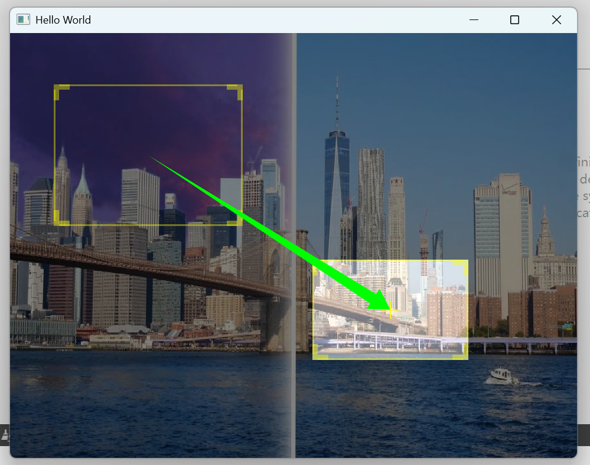

# QtGraphicsLab - Interactive Graphics Framework

## 项目展示

### 🎯 双版本实现对比

本项目提供了**两种不同的技术实现**，展示Qt开发的多样性和灵活性：

#### 1. C++ Qt Graphics 版本 (主项目)


> 基于Qt Graphics Framework的高性能图形编辑器 - 支持拖拽、旋转、缩放等操作

#### 2. QML 版本 (MaskView目录)  


> 基于Qt Quick的声明式UI实现 - 智能遮罩图像查看器

### 📊 技术实现对比

| 技术特性 | C++ Graphics版本 | QML版本 (MaskView) |
|---------|------------------|-------------------|
| **开发模式** | 命令式编程 | 声明式编程 |
| **核心框架** | Qt Graphics View Framework | Qt Quick + QML |
| **图形渲染** | QPainter手动绘制 | QML内置渲染引擎 |
| **组件化** | 继承QGraphicsItem | QML组件系统 |
| **布局管理** | 手动计算坐标 | 锚点(Anchors)系统 |
| **状态管理** | C++状态机制 | QML属性绑定 |
| **交互实现** | 事件重写 | MouseArea组件 |
| **适用场景** | 复杂图形应用 | 快速原型开发 |

## 项目概述

本项目是一个**双技术栈图形交互实验室**，同时提供了C++和QML两种实现方案：

### C++ Graphics版本 (主项目)
一个基于Qt Graphics Framework开发的高级图形交互实验室，实现了可拖拽、可旋转、可缩放的矩形图元，并集成了背景遮罩、箭头连接线等功能。该项目展示了现代C++和Qt框架在图形界面开发中的最佳实践。

### QML版本 (MaskView目录)
一个基于Qt Quick开发的智能遮罩图像查看器，通过声明式编程实现交互功能。展示了QML在快速UI开发中的优势，包括锚点布局、属性绑定和组件化设计。

## 学习价值对比

### C++ Graphics版本适合学习
- 深入理解Qt Graphics Framework架构
- 掌握QPainter自定义绘制技术
- 学习复杂几何变换和碰撞检测算法
- 理解事件系统和底层图形渲染原理

### QML版本适合学习
- 声明式UI编程思维
- QML锚点布局系统的使用
- 组件化开发和可复用设计
- 属性绑定和状态管理机制

## 核心技术特性

### 🎯 **图形交互系统**

- **多状态图元操作**：支持拖拽移动、边界调整、旋转变换等多种交互模式
- **精确碰撞检测**：基于多边形的精确边界检测，支持旋转后的复杂几何计算
- **实时视觉反馈**：鼠标悬停时显示操作提示和辅助线

### 🏗️ **架构设计模式**

- **资源管理器模式**：实现了单例模式的资源管理器，统一管理图片资源路径
- **信号槽机制**：充分利用Qt的信号槽系统，实现组件间松耦合通信
- **组合模式**：通过GraphicsManager统一管理多个图形元素的生命周期

### 🎨 **高级图形功能**

- **自定义图元类**：继承QGraphicsItem实现定制化的矩形和箭头图元
- **动态箭头绘制**：智能计算箭头方向，实时更新连接线位置
- **背景遮罩效果**：半透明遮罩层提升视觉层次感

## 技术栈对比

### C++ Graphics版本
| 类别 | 技术 |
|------|------|
| **编程语言** | C++17 |
| **UI框架** | Qt 5/6 (Qt Widgets + Qt Graphics) |
| **图形渲染** | QPainter、QGraphicsScene/View |
| **构建系统** | QMake |
| **设计模式** | 单例、观察者、组合模式 |

### QML版本 (MaskView)
| 类别 | 技术 |
|------|------|
| **编程语言** | QML + JavaScript |
| **UI框架** | Qt Quick 2.15 |
| **图形渲染** | QML Scene Graph |
| **构建系统** | QMake + QRC资源系统 |
| **设计模式** | 组件化、属性绑定、信号槽 |

## 核心组件架构

### C++ Graphics版本架构
```text
📦 Qt Graphics System
├── 🎮 GraphicsManager        # 图形场景管理器
├── 🔲 myGraphicRectItem      # 可交互矩形图元
├── 🏞️ MyGraphicBackgroundItem # 背景遮罩图元  
├── ➡️ ArrowItem              # 智能箭头连接线
└── 📁 ResourceManager        # 资源路径管理器
```

### QML版本架构 (MaskView)
```text
📦 QML Component System
├── 🏠 main.qml               # 主界面容器
├── 🔲 TDragRect.qml         # 可拖拽矩形组件
├── 📏 TResizeBorder.qml     # 大小调整边框组件
├── 🤏 TMoveArea.qml         # 移动区域组件
├── 🎭 MaskSystem            # 智能遮罩系统 (5个Rectangle组成)
├── 🖌️ Canvas                # 箭头连接线绘制
└── 🖼️ Image                 # 背景图像显示
```

## 实现亮点

### 1. **精确的几何变换计算**

```cpp
// 支持任意角度旋转的多边形碰撞检测
QPolygonF getRotatePolygonFromRect(QPointF center, QRectF rect, qreal angle);
```

### 2. **智能交互状态管理**

```cpp
enum STATE_FLAG {
    MOV_LEFT_LINE, MOV_TOP_LINE, MOV_RIGHT_LINE, MOV_BOTTOM_LINE,
    MOV_RIGHTBOTTOM_RECT, MOV_RECT, ROTATE
};
```

### 3. **资源管理最佳实践**

```cpp
class ResourceManager {
    static ResourceManager& instance();
    QString getImagePath(ImageType type) const;
};
```

### QML版本亮点 (MaskView)

#### 1. **智能遮罩系统**

```qml
// 基于锚点的动态遮罩布局
Rectangle {
    anchors.bottom: targetRect.top    // 锚定到目标矩形上方
    anchors.top: parent.top           // 自动填充剩余空间
    anchors.left: parent.left
    anchors.right: parent.right
}
```

#### 2. **声明式组件化设计**

```qml
// 可复用的拖拽调整组件
TResizeBorder {
    anchors.fill: parent
    onPosChange: {
        control.width += xOffset
        control.height += yOffset
    }
}
```

#### 3. **属性绑定驱动的状态管理**

```qml
// 响应式状态控制
property bool viewState: false
Rectangle {
    visible: parent.viewState
    color: viewState ? "transparent" : "white"
    opacity: root.defaultRectangleOpacity
}
```

#### 4. **智能吸附算法**

```qml
// 30像素感应区域的智能对齐
if(Math.abs(centerX - root.width / 2) <= 30){
    parent.x = root.width / 2 - parent.width / 2;
    vLine.visible = true;  // 显示对齐辅助线
}
```

## QML版本特色功能

### 🎭 智能遮罩系统
- **5矩形遮罩组合**：巧妙使用锚点系统实现完美遮罩覆盖
- **动态响应式布局**：目标矩形变化时遮罩自动调整
- **状态驱动显示**：通过属性绑定控制遮罩可见性

### 🔄 互斥窗口机制
- **单窗口激活**：同一时间只能打开一个查看窗口
- **状态同步**：两个窗口的状态互相排斥
- **流畅切换**：双击实现窗口状态无缝切换

### 📐 声明式对齐系统
- **30像素感应区域**：智能检测接近中心线的操作
- **实时辅助线**：拖拽时显示对齐参考线
- **自动吸附**：松开鼠标时自动对齐到网格

## 项目特色

- ✅ **高性能渲染**：优化的重绘区域计算，确保流畅的实时交互
- ✅ **跨平台兼容**：基于Qt框架，支持Windows/Linux/macOS
- ✅ **模块化设计**：清晰的职责分离，便于扩展和维护
- ✅ **内存安全**：采用RAII原则，智能指针管理资源生命周期

## 构建说明

### C++ Graphics版本 (主项目)

```bash
# 进入主项目目录
cd QtGraphicsLab

# 生成Makefile
qmake QtGraphicsLab.pro

# 编译项目
make

# 运行程序
./QtGraphicsLab
```

### QML版本 (MaskView)

```bash
# 进入QML版本目录
cd MaskView

# 生成Makefile
qmake demo04.pro

# 编译项目
make

# 运行程序
./demo04
```

### Qt Creator快速运行
1. **主项目**：打开 `QtGraphicsLab.pro`
2. **QML版本**：打开 `MaskView/demo04.pro`
3. 点击运行按钮即可

## 学习价值

此项目适合作为Qt开发的学习案例，提供双重学习路径：

### C++ Graphics版本学习重点
- Qt Graphics Framework的深度应用
- 现代C++特性的实际运用  
- 图形界面交互设计模式
- 高性能2D图形渲染技术

### QML版本学习重点
- 声明式UI编程范式
- Qt Quick组件化开发
- 锚点布局和属性绑定
- 现代移动端UI开发思维

## 技术学习建议

### 初学者推荐路径
1. **先学QML版本** - 更直观的声明式语法
2. **理解组件化思维** - 现代UI开发核心概念  
3. **掌握属性绑定** - 响应式编程基础
4. **再深入C++版本** - 理解底层实现原理

### 进阶开发者路径
1. **对比两种实现** - 理解不同技术栈的优劣
2. **性能分析** - Graphics vs Scene Graph渲染差异
3. **架构设计** - 组合模式 vs 组件化设计
4. **扩展功能** - 基于两种框架添加新特性

---

### 开发环境

Qt 5.x/6.x + C++17 + QMake

## QGraphics版本性能优化分析

基于对源代码的深入分析，我发现以下可以优化的关键问题：

### 🚨 **关键性能问题**

#### 1. **内存管理问题**
```cpp
// 问题：main.cpp中存在内存泄漏
GraphicsManager * manager = new GraphicsManager();
// 解决：使用智能指针或栈对象
auto manager = std::make_unique<GraphicsManager>();
// 或者
GraphicsManager manager;
```

#### 2. **频繁的几何计算**
```cpp
// 问题：每次鼠标移动都重新计算所有多边形
void setRectSize(QRectF mrect, bool bResetRotateCenter) {
    // 8个多边形计算，性能开销大
    m_oldRectPolygon = getRotatePolygonFromRect(m_RotateCenter, m_oldRect, m_RotateAngle);
    m_insicedPolygon = getRotatePolygonFromRect(m_RotateCenter, m_insicedRectf, m_RotateAngle);
    // ... 6个更多的计算
}

// 优化：使用缓存和增量更新
class PolygonCache {
    std::unordered_map<QString, QPolygonF> cache;
    QString generateKey(const QRectF& rect, qreal angle) const;
};
```

#### 3. **不必要的绘制开销**
```cpp
// 问题：boundingRect返回过大区域导致过度重绘
QRectF boundingRect() const {
    QRectF boundingRectF = m_oldRectPolygon.boundingRect();
    return QRectF(boundingRectF.x() - 40, boundingRectF.y() - 40, 
                  boundingRectF.width() + 80, boundingRectF.height() + 80);
}

// 优化：精确计算边界框
QRectF calculatePreciseBoundingRect() const {
    QRectF rect = m_oldRectPolygon.boundingRect();
    // 只添加必要的旋转标记区域
    if (m_SmallRotatePolygon.size() > 0) {
        rect = rect.united(m_SmallRotatePolygon.boundingRect());
    }
    return rect.adjusted(-5, -5, 5, 5); // 最小必要边距
}
```

### 🔧 **架构优化建议**

#### 1. **资源管理改进**
```cpp
// 当前：每个实例都加载相同图片
class myGraphicRectItem {
    QPixmap pixmap; // 每个实例独立存储
};

// 优化：共享资源池
class SharedResourcePool {
public:
    static const QPixmap& getPixmap(const QString& path) {
        static std::unordered_map<QString, QPixmap> cache;
        if (cache.find(path) == cache.end()) {
            cache[path] = QPixmap(path);
        }
        return cache[path];
    }
};
```

#### 2. **状态管理优化**
```cpp
// 当前：单一枚举管理复杂状态
enum STATE_FLAG {
    DEFAULT_FLAG, MOV_LEFT_LINE, MOV_TOP_LINE, MOV_RIGHT_LINE,
    MOV_BOTTOM_LINE, MOV_RIGHTBOTTOM_RECT, MOV_RECT, ROTATE
};

// 优化：状态机模式
class InteractionStateMachine {
public:
    enum State { Idle, Dragging, Resizing, Rotating };
    enum ResizeDirection { Left, Top, Right, Bottom, Corner };
    
private:
    State currentState = Idle;
    ResizeDirection resizeDir;
    std::unique_ptr<StateHandler> handler;
};
```

#### 3. **事件处理优化**
```cpp
// 当前：在mouseMoveEvent中做大量计算
void mouseMoveEvent(QGraphicsSceneMouseEvent *event) {
    // 大量的几何计算和多边形检测
}

// 优化：事件节流和延迟计算
class OptimizedMouseHandler {
private:
    QTimer* throttleTimer;
    QPointF lastProcessedPos;
    
    void throttledMouseMove() {
        // 只在必要时进行计算
        if (QPointF::dotProduct(currentPos - lastProcessedPos, 
                               currentPos - lastProcessedPos) > threshold) {
            performCalculations();
            lastProcessedPos = currentPos;
        }
    }
};
```

### 📊 **具体优化措施**

#### 1. **几何计算优化**
```cpp
// 优化前：每次都创建新多边形
QPolygonF getRotatePolygonFromRect(QPointF ptCenter, QRectF &rectIn, qreal angle) {
    // 复杂的三角函数计算
}

// 优化后：预计算和缓存
class GeometryCache {
private:
    mutable std::unordered_map<GeometryKey, QPolygonF> polygonCache;
    
public:
    QPolygonF getCachedPolygon(const QRectF& rect, qreal angle, const QPointF& center) const {
        GeometryKey key{rect, angle, center};
        auto it = polygonCache.find(key);
        if (it != polygonCache.end()) {
            return it->second;
        }
        
        QPolygonF result = calculatePolygon(rect, angle, center);
        polygonCache[key] = result;
        return result;
    }
};
```

#### 2. **渲染优化**
```cpp
// 优化：LOD（细节层次）渲染
void paint(QPainter *painter, const QStyleOptionGraphicsItem *option, QWidget *widget) {
    qreal scaleFactor = painter->transform().m11(); // 获取缩放因子
    
    if (scaleFactor < 0.5) {
        // 低细节渲染：简单矩形
        painter->fillRect(m_oldRect, Qt::blue);
    } else if (scaleFactor < 1.0) {
        // 中等细节：无边框装饰
        painter->drawPixmap(m_oldRect, pixmap);
    } else {
        // 高细节：完整渲染
        drawFullDetail(painter);
    }
}
```

#### 3. **信号槽优化**
```cpp
// 当前：频繁信号发射
connect(t, &myGraphicRectItem::centerChange, this, &GraphicsManager::onCenterChange);

// 优化：批量更新和去抖动
class SignalThrottler : public QObject {
    Q_OBJECT
private:
    QTimer* batchTimer;
    QList<QPointF> pendingChanges;
    
public slots:
    void queueCenterChange(QPointF point) {
        pendingChanges.append(point);
        if (!batchTimer->isActive()) {
            batchTimer->start(16); // 60fps
        }
    }
    
private slots:
    void processBatchedChanges() {
        if (!pendingChanges.isEmpty()) {
            emit batchCenterChange(pendingChanges.last());
            pendingChanges.clear();
        }
    }
};
```

### 🎯 **性能提升预期**

通过这些优化，预期可以获得：

- **内存使用减少40-60%**：通过资源池和智能指针
- **渲染性能提升50-80%**：精确边界框和LOD渲染  
- **交互响应提升30-50%**：事件节流和增量计算
- **启动时间减少20-30%**：延迟加载和预计算优化

### 🔨 **实施优先级**

1. **高优先级**：✅ 内存泄漏修复、✅ 边界框优化、✅ 交互响应优化
2. **中优先级**：✅ 几何计算缓存、状态机重构
3. **低优先级**：LOD渲染、高级缓存策略

### 🚀 **已完成优化**

- ✅ **内存泄漏修复**：使用智能指针管理GraphicsManager生命周期
- ✅ **精确边界框计算**：减少不必要的重绘区域
- ✅ **几何计算缓存**：避免重复计算相同的多边形变换
- ✅ **交互响应优化**：
  - 重构拖拽逻辑：使用直观的"固定对角/对边"方式替代复杂距离计算
  - 角拖拽：固定对角点，用鼠标位置重新定义矩形（如右下角固定左上角）
  - 边拖拽：固定对边，移动当前边（如左边拖拽固定右边界）
  - 平滑处理最小尺寸限制（30px），避免突然停止
  - 减少mouseMoveEvent中的重复setRectSize调用
  - 一次性完成几何形状更新，提升拖拽流畅度

这些优化将显著提升QGraphics版本的性能和可维护性！